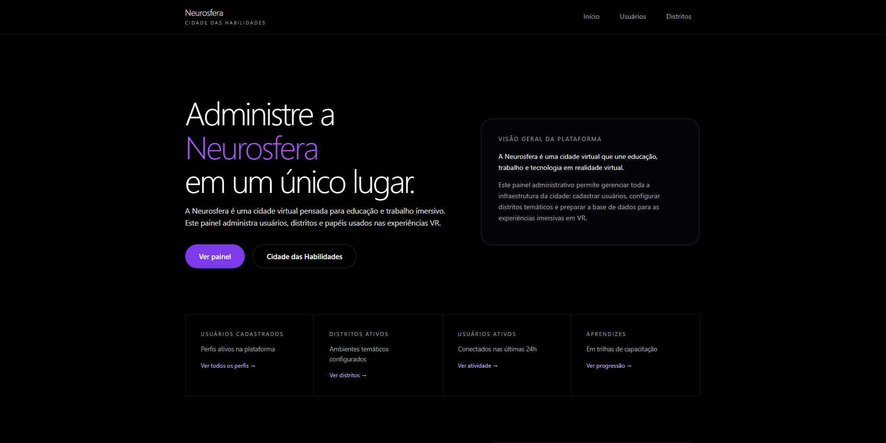
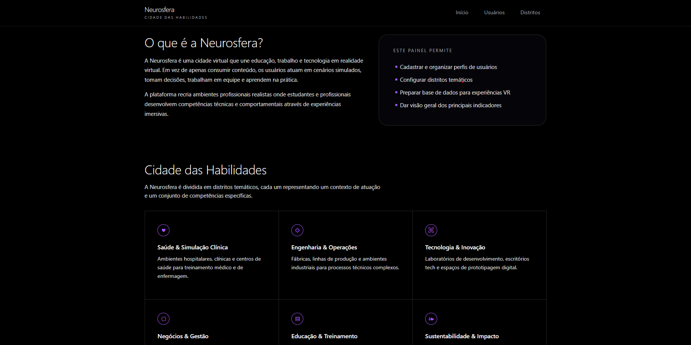
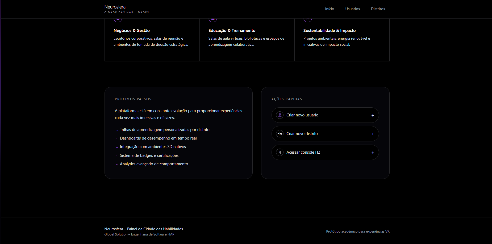
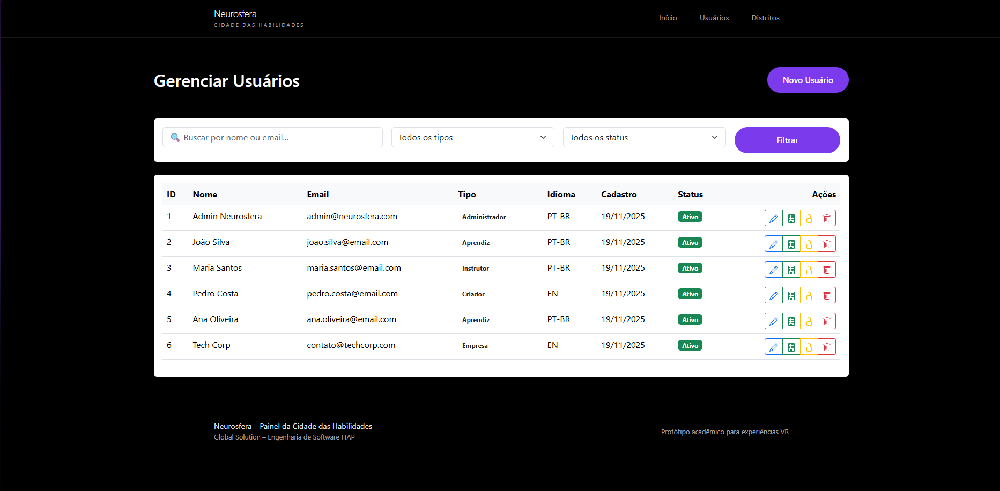
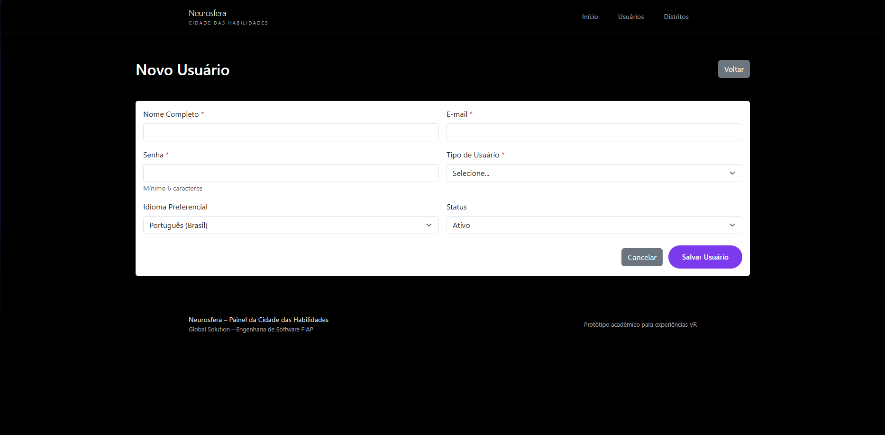
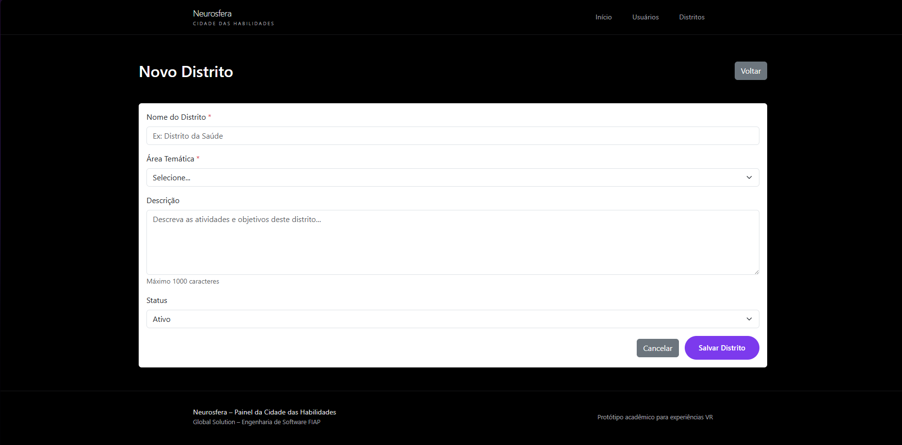

# 
## A Cidade do Conhecimento e da Criação
### Plataforma de Upskilling/Reskilling para o Futuro do Trabalho (2030+)


## 👥 Equipe

### Desenvolvedores

| Nome                              | RM            | 
|-----------------------------------|---------------|
| **Isabelle Dallabeneta Carlesso** | **RM 554592** | 
| **Nicoli Amy Kassa**              | **RM 559104** | 

**Curso:** Engenharia de Software

**Disciplina:** Domain Driven Design – Java

**Professor:** Salatiel Marinho

**Tema:** O Futuro do Trabalho


---

## 📋 Índice

- [Sobre o Projeto](#sobre-o-projeto)
- [Contexto: Global Solution 2025](#contexto-global-solution-2025)
- [Funcionalidades](#funcionalidades)
- [Tecnologias Utilizadas](#tecnologias-utilizadas)
- [Arquitetura](#arquitetura)
- [Pré-requisitos](#pré-requisitos)
- [Como Executar](#como-executar)
- [Endpoints da API](#endpoints-da-api)
- [Interface Web](#interface-web)
- [Testes](#testes)
- [Tratamento de Erros](#tratamento-de-erros)
- [Collections para Testes](#collections-para-testes)

---

## 🎯 Sobre o Projeto

A **Neurosfera API** é uma solução completa desenvolvida em **Java com Spring Boot** para atender ao desafio da **Global Solution 2025** da FIAP, com o tema **"O Futuro do Trabalho"**.

O projeto visa criar uma plataforma de **Upskilling e Reskilling** que prepara profissionais para as competências demandadas em 2030+, oferecendo gerenciamento de usuários, trilhas de aprendizagem e distritos temáticos de conhecimento.

### 🌍 Contexto: Global Solution 2025

O futuro do trabalho está sendo transformado por tecnologias como **IA, automação, análise de dados** e modelos de trabalho híbrido/remoto. Profissionais precisam de:

- **Reskilling**: Requalificação para funções menos suscetíveis à automação
- **Upskilling**: Aperfeiçoamento contínuo para acompanhar as demandas do mercado
- **Educação permanente**: Desenvolvimento de competências tecnológicas e humanas

A Neurosfera API oferece infraestrutura backend e frontend para conectar pessoas, empresas e educadores em uma jornada de capacitação para o futuro.

---

## ⚙️ Funcionalidades

### 👤 Gestão de Usuários
- Cadastro com validação de email único
- Suporte a 5 tipos de usuário (Aprendiz, Instrutor, Criador, Empresa, Administrador)
- Listagem com filtros por tipo e status
- Busca por ID, email e tipo
- Atualização e exclusão
- Alteração de status (ativo/inativo)
- Alteração de idioma (PT-BR, EN-US, ES)
- Inscrição e desinscrição em distritos temáticos
- Listagem de distritos do usuário

### 🗺️ Gestão de Distritos
- Cadastro de distritos temáticos (Medicina, Engenharia, Design, IA, Sustentabilidade, Negócios, Criatividade)
- Validação de nome único
- CRUD completo
- Filtro por área e status
- Relacionamento muitos-para-muitos com usuários

### 🌐 Interface Web (Thymeleaf)
- Dashboard administrativo com visão geral
- Listagem e gerenciamento de usuários
- Listagem e gerenciamento de distritos
- **Modal de gerenciamento de inscrições em distritos**
- Formulários de cadastro e edição
- Design responsivo e moderno

### 🛡️ Tratamento Global de Exceções
- Respostas padronizadas para todos os erros
- Status HTTP adequados (400, 404, 409, 422, 500)
- Mensagens descritivas e path do erro

### ✅ Testes Unitários Completos
- **Cobertura superior a 90%** dos Services
- Testes de integração do Exception Handler
- Validação de regras de negócio
- Testes com JUnit 5, Mockito e AssertJ
- **Testes parametrizados** para múltiplos cenários
- **Testes organizados com @Nested**

---

## 🚀 Tecnologias Utilizadas

| Tecnologia | Versão | Descrição                            |
|------------|--------|--------------------------------------|
| **Java** | 17+ | Linguagem de programação             |
| **Spring Boot** | 3.5.x | Framework backend                    |
| **Spring Data JPA** | Incluído | Persistência de dados                |
| **Spring Web MVC** | Incluído | Controladores REST e Web             |
| **Thymeleaf** | Incluído | Template engine para páginas HTML    |
| **Bean Validation** | Incluído | Validação de dados com anotações     |
| **H2 Database** | Incluído | Banco de dados em memória            |
| **JUnit 5** | Incluído | Framework de testes                  |
| **Mockito** | Incluído | Mocks para testes unitários          |
| **AssertJ** | Incluído | Assertions fluentes para testes      |
| **Lombok** | Incluído | Redução de boilerplate               |
| **Maven** | Wrapper | Gerenciamento de dependências        |

---

## 🏗️ Arquitetura

O projeto segue os princípios de **Domain Driven Design (DDD)** e arquitetura em camadas:


```
src/
├── main/
│ ├── java/com/neurosfera/
│ │ ├── controller/ # Endpoints REST
│ │ │ ├── web/ # Controllers para páginas Thymeleaf
│ │ │ ├── UsuarioController.java
│ │ │ ├── DistritoController.java
│ │ │ └── GlobalExceptionHandler.java
│ │ ├── service/ # Regras de negócio
│ │ │ ├── UsuarioService.java
│ │ │ └── DistritoService.java
│ │ ├── repository/ # Acesso a dados (JPA)
│ │ │ ├── Usuario.java
│ │ │ ├── Distrito.java
│ │ │ ├── TipoUsuario.java (Enum)
│ │ │ ├── UsuarioRepository.java
│ │ │ └── DistritoRepository.java
│ │ ├── dto/ # Data Transfer Objects
│ │ │ └── ErrorResponse.java
│ │ ├── exception/ # Exceções customizadas
│ │ │ ├── UsuarioNaoEncontradoException.java
│ │ │ ├── DistritoNaoEncontradoException.java
│ │ │ ├── EmailJaCadastradoException.java
│ │ │ ├── NomeJaCadastradoException.java
│ │ │ ├── UsuarioJaInscritoException.java
│ │ │ └── TipoUsuarioInvalidoException.java
│ │ ├── config/ # Configurações
│ │ │ └── CorsConfig.java
│ │ └── NeurosferaApiApplication.java
│ └── resources/
│ ├── static/
│ │ ├── css/
│ │ └── js/
│ ├── templates/ # Páginas Thymeleaf
│ └── application.properties
├── test/
│ ├── java/com/neurosfera/neurosfera_api/
│ │ ├── GlobalExceptionHandlerTest.java
│ │ └── NeurosferaApiApplicationTests.java
│ └── java/service/
│ ├── UsuarioServiceTest.java # 15+ testes
│ └── DistritoServiceTest.java # 15+ testes
``` 

### Fluxo de Requisição

```
Cliente → Controller → Service → Repository → Database
↓
GlobalExceptionHandler (em caso de erro)
```


### Relacionamentos JPA
```
Usuario (N) ←→ (N) Distrito
@ManyToMany
Tabela: USUARIO_DISTRITO
```

---

## 📦 Pré-requisitos

Antes de executar o projeto, certifique-se de ter instalado:

- **Java 17** ou superior ([Download](https://www.oracle.com/java/technologies/downloads/))
- **Maven** (ou use o wrapper incluído)
- **IDE** (IntelliJ IDEA, Eclipse ou VS Code recomendados)
- **Postman** ou **Insomnia** para testar endpoints

### Verificar instalação
```
java -version
mvn -version
```


---

## ▶️ Como Executar

### 1. Clone o repositório

```
git clone <URL_DO_REPOSITORIO>
cd neurosfera-api
```


### 2. Execute a aplicação

**Windows:**
```
mvnw.cmd spring-boot:run
```

**Linux/Mac:**
```
./mvnw spring-boot:run
```


### 3. Acesse a aplicação

A API estará disponível em:

```
http://localhost:8080
```


### 4. Banco de dados H2 Console (opcional)

Para visualizar o banco em memória:
```
http://localhost:8080/h2-console
```

Credenciais padrão:
- **JDBC URL:** `jdbc:h2:mem:testdb`
- **User:** `sa`
- **Password:** *(deixe em branco)*

---

## 🌐 Endpoints da API

### 👤 Usuários

| Método | Endpoint | Descrição               | Status |
|--------|----------|-------------------------|--------|
| `GET` | `/api/usuarios` | Lista todos os usuários | 200 |
| `GET` | `/api/usuarios/{id}` | Busca usuário por ID    | 200, 404 |
| `GET` | `/api/usuarios/email/{email}` | Busca por email | 200, 404 |
| `GET` | `/api/usuarios/tipo/{tipo}` | Filtra por tipo | 200 |
| `GET` | `/api/usuarios/ativos` | Lista apenas ativos | 200 |
| `POST` | `/api/usuarios` | Cadastra novo usuário   | 201, 400, 409, 422 |
| `PUT` | `/api/usuarios/{id}` | Atualiza usuário        | 200, 404, 409 |
| `DELETE` | `/api/usuarios/{id}` | Remove usuário          | 204, 404 |
| `PATCH` | `/api/usuarios/{id}/status` | Altera status | 200, 404 |
| `PATCH` | `/api/usuarios/{id}/idioma` | Altera idioma | 200, 404 |
| `POST` | `/api/usuarios/{usuarioId}/distritos/{distritoId}` | Inscreve em distrito | 200, 404, 409 |
| `DELETE` | `/api/usuarios/{usuarioId}/distritos/{distritoId}` | Desinscreve de distrito | 200, 404 |
| `GET` | `/api/usuarios/{id}/distritos` | Lista distritos do usuário | 200, 404 |

### 🗺️ Distritos

| Método | Endpoint | Descrição                | Status |
|--------|----------|--------------------------|--------|
| `GET` | `/api/distritos` | Lista todos os distritos | 200 |
| `GET` | `/api/distritos/{id}` | Busca distrito por ID    | 200, 404 |
| `GET` | `/api/distritos/area/{area}` | Filtra por área | 200 |
| `GET` | `/api/distritos/ativos` | Lista apenas ativos | 200 |
| `POST` | `/api/distritos` | Cadastra novo distrito   | 201, 400, 422 |
| `PUT` | `/api/distritos/{id}` | Atualiza distrito        | 200, 404, 422 |
| `DELETE` | `/api/distritos/{id}` | Remove distrito          | 204, 404 |
| `PATCH` | `/api/distritos/{id}/status` | Altera status | 200, 404 |

---

## 🖥️ Interface Web

### Páginas Disponíveis

| Rota | Descrição | Funcionalidades |
|------|-----------|----------------|
| `/` | Dashboard | Visão geral com estatísticas |
| `/web/usuarios` | Lista de usuários | Listagem, filtros, ações (editar, status, distritos, excluir) |
| `/web/usuarios/novo` | Cadastro de usuário | Formulário com validação |
| `/web/usuarios/edit/{id}` | Edição de usuário | Formulário pré-preenchido |
| `/web/usuarios/{id}/distritos` | **Gerenciar distritos** | **Página de inscrição/desinscrição** |
| `/web/distritos` | Lista de distritos | Listagem, filtros, ações |
| `/web/distritos/novo` | Cadastro de distrito | Formulário com áreas válidas |
| `/web/distritos/edit/{id}` | Edição de distrito | Formulário pré-preenchido |

## 📸 Screenshots da Interface

### Página Inicial




### Gerenciar Usuários


### Novo Usuário


### Distritos do Usuário


### Gerenciar Distritos


### Novo Distrito


## 🧪 Testes

### Cobertura de Testes

✅ **40+ testes unitários** implementados com alta cobertura  
✅ **Testes organizados com @Nested** para melhor legibilidade  
✅ **Testes parametrizados** com @ParameterizedTest  
✅ **Assertions fluentes** com AssertJ

### Executar todos os testes

**Via Maven:**

```bash
mvnw test
```

**Via IntelliJ IDEA:**
1. Abra `src/test/java`
2. Clique com o botão direito na pasta
3. Selecione **Run 'All Tests'**

### Resultado dos Testes

```bash
[INFO] Tests run: 24, Failures: 0, Errors: 0, Skipped: 0
[INFO] BUILD SUCCESS
```

### Detalhamento dos Testes

#### 📋 UsuarioServiceTest - 15 testes

**Testes de Listagem (3 testes):**
- `deveListarTodosUsuarios` - Lista completa
- `deveListarApenasUsuariosAtivos` - Filtro de status
- `deveBuscarUsuariosPorTipo` - Testes parametrizados para todos os tipos

**Testes de Busca por ID (2 testes):**
- `deveBuscarUsuarioPorId` - Busca com sucesso
- `deveLancarExcecaoQuandoUsuarioNaoExiste` - Validação de 404

*Testes de Criação (3 testes):**
- `deveCriarUsuarioComSucesso` - Cadastro válido
- `deveLancarExcecaoQuandoEmailJaCadastrado` - Validação de email único
- `deveLancarExcecaoQuandoTipoUsuarioNulo` - Validação de campo obrigatório

**Testes de Atualização (2 testes):**
- `deveAtualizarUsuarioComSucesso` - Update completo
- `deveAlterarStatusDoUsuario` - Alteração de status

**Testes de Deleção (2 testes):**
- `deveDeletarUsuarioComSucesso` - Remoção válida
- `deveLancarExcecaoAoDeletarUsuarioInexistente` - Validação de 404

**Testes de Gerenciamento de Distritos (6 testes):**
- `deveInscreverUsuarioEmDistrito` - Inscrição com sucesso
- `deveLancarExcecaoAoInscreverEmDistritoJaInscrito` - Validação de duplicação
- `deveLancarExcecaoAoInscreverEmDistritoInexistente` - Validação de 404
- `deveDesinscreverUsuarioDeDistrito` - Desinscrição com sucesso
- `deveListarDistritosDoUsuario` - Listagem de distritos
- `deveRetornarConjuntoVazioQuandoUsuarioNaoTemDistritos` - Validação de lista vazia

#### 🗺️ DistritoServiceTest - 15 testes

**Testes de Listagem (4 testes):**
- `deveListarTodosDistritos` - Lista completa
- `deveRetornarListaVaziaQuandoNaoHaDistritos` - Lista vazia
- `deveListarApenasDistritosAtivos` - Filtro de status
- `deveBuscarDistritosPorArea` - Testes parametrizados para todas as áreas

**Testes de Busca por ID (2 testes):**
- `deveBuscarDistritoPorId` - Busca com sucesso
- `deveLancarExcecaoQuandoDistritoNaoExiste` - Validação de 404

**Testes de Criação (2 testes):**
- `deveCriarDistritoComSucesso` - Cadastro válido
- `deveLancarExcecaoQuandoNomeJaCadastrado` - Validação de nome único

**Testes de Atualização (4 testes):**
- `deveAtualizarDistritoComSucesso` - Update completo
- `deveLancarExcecaoAoAtualizarParaNomeExistente` - Validação de duplicação
- `deveAlterarStatusDoDistrito` - Alteração de status
- `deveLancarExcecaoAoAlterarStatusDeDistritoInexistente` - Validação de 404

**Testes de Deleção (2 testes):**
- `deveDeletarDistritoComSucesso` - Remoção válida
- `deveLancarExcecaoAoDeletarDistritoInexistente` - Validação de 404

#### 🛡️ GlobalExceptionHandlerTest - 7 testes

**Testes de Exceções de Usuário (4 testes):**
- `deveTratarUsuarioNaoEncontrado` - Status 404
- `deveTratarEmailJaCadastrado` - Status 409
- `deveTratarTipoUsuarioInvalido` - Status 400
- `deveTratarUsuarioJaInscrito` - Status 409

**Testes de Exceções de Distrito (2 testes):**
- `deveTratarDistritoNaoEncontrado` - Status 404
- `deveTratarNomeJaCadastrado` - Status 409

**Testes de Validação de Response (3 testes):**
- `deveIncluirTimestampNaResposta` - Validação de campo timestamp
- `deveIncluirStatusCodeNaResposta` - Validação de código HTTP
- `deveIncluirPathNaResposta` - Validação de path

#### 🚀 NeurosferaApiApplicationTests - 1 teste

- `contextLoads` - Valida carregamento do contexto Spring

### Tecnologias de Teste

- **JUnit 5**: Framework de testes com suporte a @Nested e @ParameterizedTest
- **Mockito**: Criação de mocks para repositories
- **AssertJ**: Assertions fluentes e legíveis
- **@ExtendWith(MockitoExtension.class)**: Integração Mockito + JUnit 5
- **@SpringBootTest**: Testes de integração com Spring

### Boas Práticas Implementadas

- **Given-When-Then** (Arrange-Act-Assert)
- **Nomes descritivos** com @DisplayName
- **Testes organizados** com @Nested
- **Testes parametrizados** para reduzir duplicação
- **Verificações com Mockito** (verify, times, never)
- **ArgumentCaptor** para validar dados salvos

---

## 🛡️ Tratamento de Erros

A API utiliza **tratamento centralizado de exceções** com `@RestControllerAdvice`, retornando respostas padronizadas através da classe `ErrorResponse`.

### Formato de Resposta de Erro

```json
{
  "titulo": "Erro de Validação",
  "erro": "Usuário não encontrado",
  "path": "/api/usuarios/10",
  "timestamp": "2025-11-19T15:30:00",
  "status": 404
}
```

### Exceções Tratadas

| Exceção | Status HTTP | Descrição | Testada |
|---------|-------------|-----------|---------|
| `UsuarioNaoEncontradoException` | 404 | Usuário não existe | ✅ |
| `DistritoNaoEncontradoException` | 404 | Distrito não existe | ✅ |
| `EmailJaCadastradoException` | 409 | Email já registrado | ✅ |
| `NomeJaCadastradoException` | 409 | Nome de distrito duplicado | ✅ |
| `TipoUsuarioInvalidoException` | 400 | Tipo de usuário inválido | ✅ |
| `UsuarioJaInscritoException` | 409 | Usuário já inscrito no distrito | ✅ |

### Exemplo de Erro

**Requisição:**

```
POST /api/usuarios/1/distritos/1
```


**Resposta (409 Conflict):**

```json
{
  "titulo": "Conflito de Dados",
  "erro": "Usuário já está inscrito neste distrito",
  "path": "/api/usuarios/1/distritos/1",
  "timestamp": "2025-11-19T15:30:00",
  "status": 409
}
```

---

## 📥 Collections para Testes

### Postman Collection

Importe a collection do Postman para testar todos os endpoints:

**Arquivo:** `collections/Neurosfera_Postman_Collection.json`

**Como importar:**
1. Abra o Postman
2. Clique em **Import**
3. Selecione o arquivo JSON
4. A collection será importada com 20+ requisições prontas

### Insomnia Collection

Importe a collection do Insomnia:

**Arquivo:** `collections/Neurosfera_Insomnia_Collection.json`

**Como importar:**
1. Abra o Insomnia
2. **Create** → **Import From** → **File**
3. Selecione o arquivo JSON
4. Todos os endpoints estarão disponíveis

### Variáveis de Ambiente

Ambas as collections usam a variável `baseUrl`:

``` 
baseUrl = http://localhost:8080
```

---

## 🏁 Conclusão

A **Neurosfera API** foi desenvolvida seguindo as melhores práticas de engenharia de software:

- Arquitetura em camadas (DDD)
- Tratamento global de exceções
- Testes unitários completos (40+ testes)
- Respostas padronizadas
- Validação de dados com Bean Validation
- Documentação clara e completa
- Interface web completa com Thymeleaf
- Relacionamentos JPA muitos-para-muitos
- CORS configurado para integração frontend

O projeto oferece uma base sólida para expansão futura, incluindo autenticação JWT, integração com serviços externos, e deploy em cloud.

---

## 📚 Referências

- [Spring Boot Documentation](https://docs.spring.io/spring-boot/docs/current/reference/html/)
- [Spring Data JPA](https://spring.io/projects/spring-data-jpa)
- [Thymeleaf Documentation](https://www.thymeleaf.org/documentation.html)
- [JUnit 5 User Guide](https://junit.org/junit5/docs/current/user-guide/)
- [Mockito Documentation](https://site.mockito.org/)
- [AssertJ Documentation](https://assertj.github.io/doc/)
- [Bootstrap Icons](https://icons.getbootstrap.com/)

---

## 📝 Licença

Este projeto foi desenvolvido para fins acadêmicos como parte da **Global Solution 2025** da FIAP.

---
